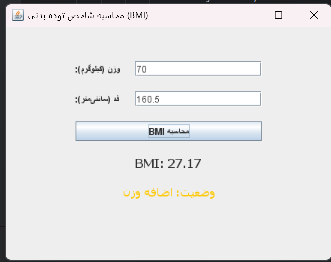
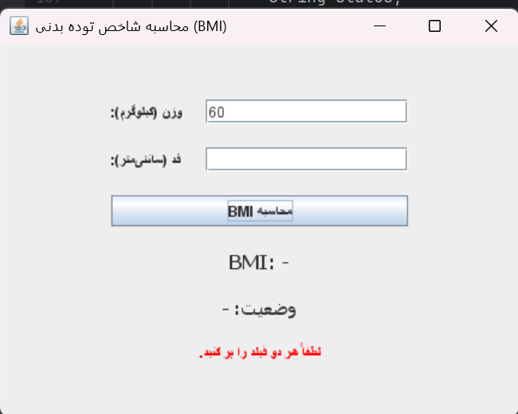

# محاسبه‌گر شاخص توده بدنی (BMI) با Java Swing

این پروژه یک برنامه ساده برای محاسبه BMI است که با استفاده از Swing ساخته شده است.

### ویژگی‌ها:
- ورودی وزن (کیلوگرم) و قد (سانتی‌متر)
- اعتبارسنجی ورودی‌ها (خالی نبودن، عددی بودن، مثبت بودن)
- نمایش BMI با دو رقم اعشار
- نمایش وضعیت بدنی با رنگ متفاوت:
  - کم وزن (آبی)
  - نرمال (سبز)
  - اضافه وزن (نارنجی)
  - چاق (قرمز)
- پیام خطا داخل فرم (با JLabel قرمز)

### اسکرین‌شات‌ها:

### نحوه اجرا:
کد را در IntelliJ یا هر IDE جاوا باز کنید و اجرا کنید.
